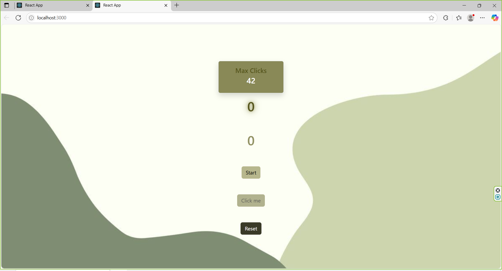

# ⏱️ React Countdown Timer & Click Counter App

A simple and clean project built with **React**, **TypeScript**, **Zustand**, and **Bootstrap**. This app features a countdown timer and a click counter that only works while the timer is active.

---

## 🎯 Features

- ⏳ Countdown timer from 10 to 0 on "Start"
- 🖱️ "Click Me" button increments the counter while timer is active
- 🔁 "Reset" button sets both timer and counter back to 0
- 💾 "Max Clicks" is saved in localStorage using Zustand's `persist` middleware
- 📦 Global state management using Zustand
- 🎨 Styling with Bootstrap and custom CSS

---

## 🧪 Demo



---

## 🛠️ Technologies Used

- [React](https://react.dev/)
- [TypeScript](https://www.typescriptlang.org/)
- [Zustand](https://zustand-demo.pmnd.rs/)
- [Bootstrap](https://getbootstrap.com/)
- CSS Modules / Custom CSS

---

## 📁 Project Structure

```
src/
├── components/
│   └── home.tsx                # Main component
├── images/                     # Background image
├── store/                      # Zustand store (with persist)
│   └── useCounterStore.ts
├── interfaces/                 # TypeScript interfaces
│   └── CounterState.ts
├── inde.tsx               # Entry point
├── App.css                # Custom styles
└── App.tsx               # Entry point
```

---

## 🚀 Getting Started

### 1. Clone the repository

```bash
git clone https://github.com/saniarahnama/React-Typescript-counter-game
cd react-timer-counter
```

### 2. Install dependencies

```bash
npm install
```

### 3. Run the project

```bash
npm run dev
```

---

## 💡 Possible Improvements

- Add a sound or animation when timer ends
- Display a message like "Time's up!" when countdown finishes
- Convert to a mobile-friendly version (React Native or PWA)

---

## 👨‍💻 Author

Created by [sania rahnama]  
GitHub: [@saniarahnama](https://github.com/saniarahnama)

---
